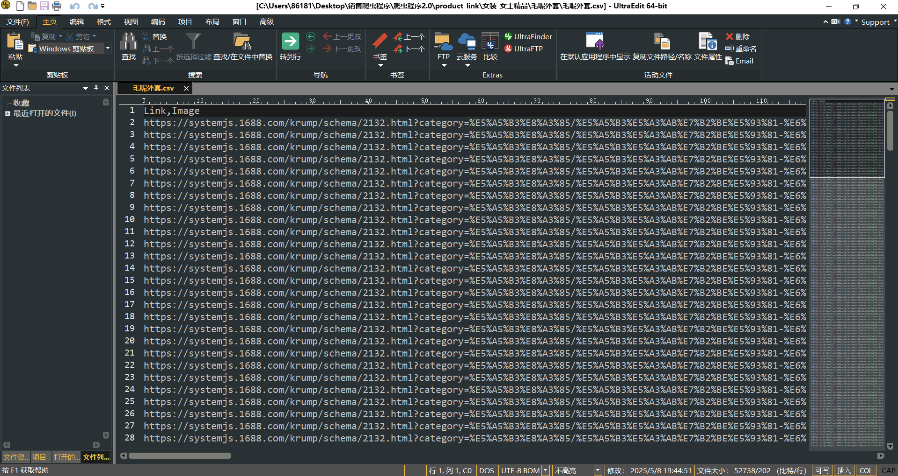

# taobao-business-opportunity-crawler
本项目是一个基于 Python 的淘宝“下游商机”页面爬虫，能够自动化抓取电商平台上的热门商品数据，包括商品名称、点击率、交易指数、热度变化趋势等核心指标。

该数据可广泛应用于：

🛍️ 电商选品分析：快速识别高潜商品，辅助上架与推广决策；

📈 市场趋势研究：追踪商品热度走势，捕捉行业风口；

💹 股票与产业链分析：结合商品热度与转化率，洞察消费类上市公司的动向。

如果你从事电商运营、行业研究、数据分析或金融研究，本项目将是你不可多得的数据采集利器。
  
**🛒输出结果**  
  
```
| 一级类目(女装_女士精品)
├───── 二级类目(毛呢外套)
├──────────三级类目(毛呢外套.xlsx)
├── 二级类目(中老年女装)
├──────────三级类目(中老年女装.xlsx)
| 一级类目
├── 二级类目
├── 二级类目
... ...
```
  
| 图片 | 链接 | 图片链接 | 商品名称 | 搜索人气 | 搜索热度 | 点击人气 | 点击热度 | 点击率 | 交易指数 | 支付转化率 | 商品指数 | 飙升热度（%） |
|------|------|-----------|----------|----------|----------|----------|----------|--------|-----------|--------------|------------|----------------|
|  | https://detail.tmall.com/item.htm?id=819225550121 | https://img.alicdn.com/imgextra/i2/2207889672869/O1CN01Klgm9X1X43DER5RnJ_!!2207889672869.jpg | pusumede棕色西装毛呢外套女冬季新款设计感夹棉气质短款羊毛上衣 | 1,395,977 | 4,868,336 | 39 | 45 | 0% | 950 | 0% | 5 | 10.77 |
|  | https://detail.tmall.com/item.htm?id=805429276601 | https://img.alicdn.com/imgextra/i3/2867680446/O1CN01sQZLNU1FAJbt1Jkpw_!!0-item_pic.jpg | 夏季慵懒薄款灰色防晒开衫外套女春配吊带黑色针织空调外搭小上衣 | 820,840 | 1,063,564 | 45,744 | 55,161 | 6% | 213,566 | 6% | 5,789 | 312.06 |


**⚙️输出中间结果**  
  



**📁项目结构**  
  
```
taobao-business-opportunity-crawler/
├── chromedriver-win64/         # ChromeDriver 驱动文件，用于 Selenium 自动化
├── main.py                     # 项目主入口，用于调度整个爬虫流程
├── config.py                   # 配置文件，可调节时间范畴，爬取榜单，多进程的数量，是否有头 等
├── crawler.py                  # 爬取商机链接和对应图像链接模块，使用爬取链接和解析链接两步进行提高效率
├── pipeline.py                 # 图片链接解析模块，商机链接解析模块
├── final_process.py            # 最后格式处理，并根据爬取的数据计算新指标
├── 一级类目.xlsx               # 初始输入文件，包含待爬取链接或类目信息，可多选多个一级目录
├── README.md                   # 项目说明文档
```
  
**💻配置文件介绍**  
  
可以通过配置文件调节爬虫代码爬取范围，爬取速度等，并且config文件内置随机请求头，防止检测
```
"""
config.py：提供大量请求头，防止平台检测到爬虫程序，从而拒绝服务
"""
# ——————————————————————————————————————————————————————

time_range = "7" # 人为设置需要爬取的时间，另一个值是设置为7
# 参考 可改成 ： time_range = "7"

category = "热销榜" # 人为设置‘热搜榜’，‘飙升榜’，‘热销榜’
# 参考 可改成 ： category = "飙升榜"
# 参考 可改成 ： category = "热销榜"

processing_quantity = 2 # 多进程的数量，控制爬取速度，最好与网速和cpu性能挂钩
# 参考 可改成 ： processing_quantity = 10

is_head = True # 是否有头，True代表有头，False代表无头

operation_steps = [1,1,1] # 分别对应‘爬取链接’，‘解析链接’，‘最终处理’， 1对应进行该步骤，0代表不进行

# ——————————————————————————————————————————————————————
```

  
  

**🔍使用教程**  
  
0、配置环境（可选）
本代码会自动配置环境，因此无需事先配置环境，如果读者防止污染环境，需提前改变环境去运行当前代码
（因为当前代码是使用清华源pip去在当前环境配置）
  
1、配置文件
运行前调整 'config.py' 与 '一级类目.xlsx' 文件，前者负责控制爬取的参数，后者控制爬取的类目（可多选/单选）

2、运行代码
点击 main.py 即可，main会依次调用crawler.py，pipeline.py，final_process.py，分别对应爬取链接，解析链接，
最后格式处理

最后输出的结果应该生成两个文件夹，分别是product_link，output两个文件夹，其中output是最后结果存储文件夹

  
  

**⚠️代码运行注意**  
  
运行代码的时候不要打开output文件夹下的excel文件，可能会造成文件损坏（本项目已经内置损坏文件输出）。
即便代码意外退出也不要惊慌，因为代码具备跳过已爬取文件的功能。

  
  
**✅爬取代码功能**  
  
1.自动配置环境  
2.支持断点续爬  
3.支持多进程爬取  
4.支持无头/有头模式  
5.支持爬取不同榜单  
6.意外损失文件输出（可手动删除损坏文件后再运行代码）

**🔒使用说明**
本项目仅限学习使用，切勿它用，并注意不要对服务器造成负担，控制爬取速率

